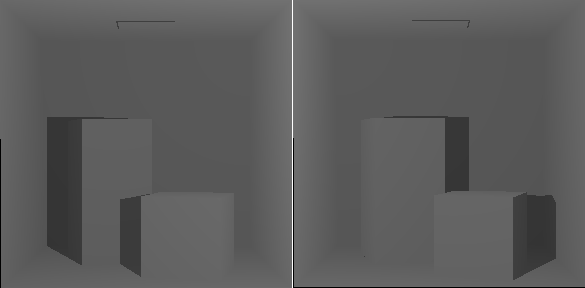

<h1>Vulkan RTX Demo</h1>

Minimal single file Vulkan RTX demo on how to do shadows using ray queries.
The only dependecies are GLFW and GLM, already packed in the repository. It requires Vulkan 1.2, SPIRV 1.4 and support to GL_EXT_ray_tracing and GL_EXT_ray_query.

<h2>Installation setup</h2>

Tested on windows 10.

<ol>
<li>Change the #define RESOURCES_DIR to your repo folder path resources, where the shader files are stored.</li>
<li>Change the #define VULKAN_SDK_PATH to your Vulkan SDK folder containing the glslc.exe file.</li>
</ol>

<h2>Results</h2>
